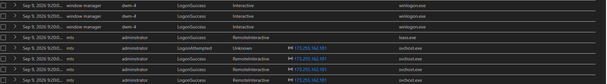
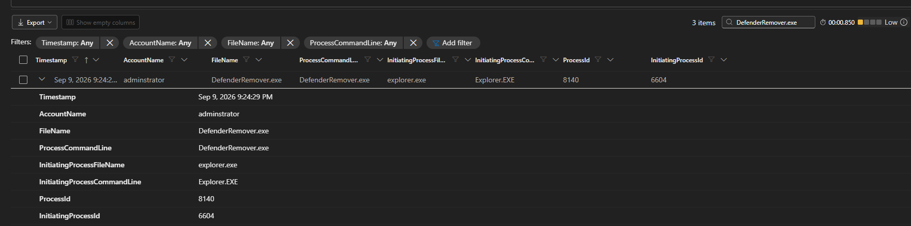
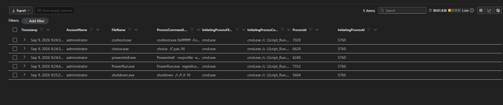
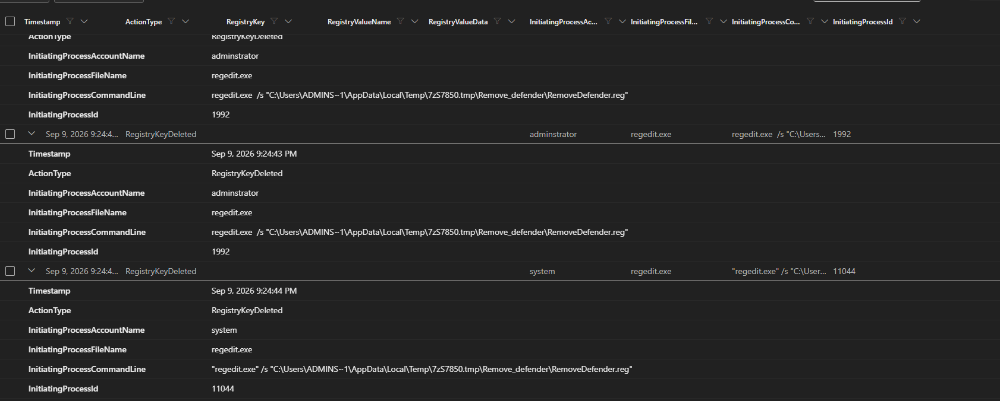

# Microsoft Defender XDR – DefenderRemover / RDP Investigation

## Investigation Overview

This investigation was performed in an isolated MYDFIR lab environment using Microsoft Defender XDR.

The investigation began after Microsoft Defender XDR generated alerts related to attempts to disable Microsoft Defender Antivirus protections on `mts-dc.mts.local`.

The investigation focused on determining what activity occurred before and after the security-control modification. Microsoft Defender XDR Advanced Hunting was used to correlate remote logon activity, suspicious process execution, child-process activity, registry changes, and external threat-intelligence results.

The evidence showed remote interactive logon activity involving the `mts\administrator` account followed by execution of `DefenderRemover.exe`, additional command and PowerShell activity, and registry deletion activity involving `RemoveDefender.reg`.

**Verdict:** True Positive – Malicious Activity

---

## Investigation Summary

**Affected Device:** `mts-dc.mts.local`

**Affected Account:** `mts\administrator`

**Primary Findings:**

- Microsoft Defender XDR generated high-severity alerts for attempts to turn off Microsoft Defender Antivirus protection.
- RemoteInteractive logon activity was observed for the `mts\administrator` account.
- `DefenderRemover.exe` executed under the administrator account.
- The executable ran with elevated privileges.
- Additional command-line and PowerShell-related child processes were observed.
- Registry deletion activity was performed using `RemoveDefender.reg`.
- VirusTotal provided strong supporting reputation evidence for `DefenderRemover.exe`.

---

## 1. Initial Alert

Microsoft Defender XDR showed multiple alerts associated with attempts to turn off Microsoft Defender Antivirus protection on `mts-dc.mts.local`.

The selected alert was classified as **High severity** and mapped by Microsoft Defender to defense-evasion activity. The incident graph also showed relationships between the affected device, users, processes, files, registry values, and network activity.

This alert provided the starting point for the investigation.

> **Evidence:** Microsoft Defender XDR incident / attack story showing the Defender Antivirus protection alert.

---

## 2. Remote Logon Analysis

Advanced Hunting was used to review authentication activity involving the affected system and administrator account.

The results showed multiple successful logon events associated with `mts\administrator`, including `RemoteInteractive` activity. Remote IP addresses observed in the logon telemetry included:

- `131.109.131.82`
- `173.255.162.181`

The presence of these addresses in the telemetry establishes that they were observed during authentication activity. The logon data alone does not establish that every observed IP address was malicious.

### RDP / RemoteInteractive Evidence

The RemoteInteractive events were important because they provided authentication-level evidence that could be correlated with the suspicious endpoint activity that followed.

---

## 3. DefenderRemover Execution

Advanced Hunting identified execution of `DefenderRemover.exe` under the `administrator` account.

The process telemetry showed:

- **File:** `DefenderRemover.exe`
- **Account:** `administrator`
- **Initiating Process:** `explorer.exe`
- **Process ID:** `8140`
- **Initiating Process ID:** `6604`

### Process Evidence

The evidence indicates that `explorer.exe` initiated `DefenderRemover.exe`, providing an important pivot from the initial alert into the endpoint execution chain.

---

## 4. DefenderRemover File Analysis

Microsoft Defender XDR process details provided additional information about the executable.

Observed details included:

- **Execution Time:** Sep. 9, 2026, 9:24:31 PM
- **Command Line:** `"DefenderRemover.exe"`
- **Path:** `C:\Users\administrator\Desktop\DefenderRemover.exe`
- **Token Elevation:** Full
- **Integrity Level:** High
- **Signer:** Unknown
- **SHA256:** `c8dfedfdb3ee6c5761ac119655d522850abd84649e13d0bf55efa8f0ad47f7d7`

The elevated token and high integrity level showed that the process was executing with significant privileges.

---

## 5. Child-Process Analysis

The investigation pivoted from the suspicious execution into related process activity.

Advanced Hunting showed child processes associated with `cmd.exe`, including:

- `conhost.exe`
- `choice.exe`
- `powershell.exe`
- `PowerRun.exe`
- `shutdown.exe`

### Child-Process Evidence

The child-process activity helped reconstruct the execution chain and showed that the activity extended beyond the initial `DefenderRemover.exe` execution.

Of particular interest were PowerShell execution, `PowerRun.exe`, and the later shutdown command.

---

## 6. Registry Modification Analysis

Registry telemetry was reviewed to determine whether the suspicious execution affected Microsoft Defender configuration.

Advanced Hunting identified registry deletion activity initiated by `regedit.exe`.

The command line referenced:

`Remove_defender\RemoveDefender.reg`

Registry deletion events occurred under both the `administrator` and `SYSTEM` security contexts.

### Registry Evidence

The registry telemetry strengthened the correlation between the suspicious process activity and attempts to modify security-related configuration.

---

## 7. Threat Intelligence – VirusTotal

The SHA256 hash associated with `DefenderRemover.exe` was investigated using VirusTotal:

`c8dfedfdb3ee6c5761ac119655d522850abd84649e13d0bf55efa8f0ad4f7fd7`

At the time of the external lookup captured during the investigation, VirusTotal showed:

**45 / 63 security vendors flagged the file as malicious.**

Threat labels visible in the results included references to:

- Trojan
- Hacktool
- PUA
- KillAV
- Disable Defender

### VirusTotal Evidence

VirusTotal was used as supporting threat-intelligence evidence. The external reputation result was considered together with the endpoint, authentication, process, and registry telemetry rather than being used as the sole basis for the verdict.

---

## 8. IP Enrichment

### VirusTotal IP Reputation

The IP address `131.109.131.82`, identified during the authentication review, was investigated using VirusTotal.

At the time of analysis, **7 of 89 security vendors flagged the IP address as malicious**. Several vendors categorized the address as malicious, phishing-related, or associated with malware activity.

This reputation result was treated as supporting threat-intelligence evidence and was correlated with the authentication and endpoint activity observed during the investigation.

WHOIS enrichment was performed on `131.109.131.82`.

The lookup associated the address range with:

**Rhode Island Network for Educational Technology (RINET)**

This WHOIS result identifies registration information for the IP address but does not by itself establish malicious activity.

The IP was therefore treated as an observed network indicator requiring correlation with the surrounding authentication and endpoint telemetry.

---

## 9. Investigation Timeline

| Time | Observed Activity |
|---|---|
| ~9:20 PM | RemoteInteractive activity observed involving `mts\administrator` |
| 9:24:29–9:24:31 PM | `DefenderRemover.exe` execution observed |
| 9:24:31 PM | Defender process details show elevated execution |
| ~9:24 PM | Related command, PowerShell, PowerRun, and other child-process activity observed |
| 9:24:43 PM | Registry deletion activity observed through `regedit.exe` |
| 9:24:44 PM | Additional registry deletion activity observed under `SYSTEM` context |
| Later analysis | File hash investigated using VirusTotal |

The timeline shows close temporal proximity between remote interactive activity, suspicious process execution, and registry modification.

---

## 10. Evidence Correlation

The investigation used multiple independent telemetry sources rather than relying on a single alert.

The evidence chain was:

**Defender Alert → Logon Analysis → RemoteInteractive Activity → Process Analysis → DefenderRemover Execution → Child Processes → Registry Activity → IOC Enrichment → Verdict**

This correlation was important because each source answered a different investigative question:

- **Alert telemetry** identified the suspicious behavior.
- **Authentication telemetry** showed activity involving the affected account.
- **Process telemetry** identified the suspicious executable and execution context.
- **Child-process telemetry** helped reconstruct subsequent activity.
- **Registry telemetry** showed configuration-related changes.
- **Threat intelligence** provided additional reputation context for the executable.

---

## 11. MITRE ATT&CK Mapping

Based on the observed behavior, the investigation is consistent with the following MITRE ATT&CK concepts:

| Technique | Description | Evidence |
|---|---|---|
| **T1562.001 – Impair Defenses: Disable or Modify Tools** | Activity attempted to interfere with Microsoft Defender protections | Defender alert, DefenderRemover activity, registry evidence |
| **T1021.001 – Remote Services: Remote Desktop Protocol** | RemoteInteractive activity was observed during the investigation | Logon telemetry |
| **T1059.001 – Command and Scripting Interpreter: PowerShell** | `powershell.exe` appeared in related child-process telemetry | Process hunting |
| **T1112 – Modify Registry** | Registry activity involving `regedit.exe` and `RemoveDefender.reg` was observed | Registry telemetry |

The mappings describe behaviors observed during the investigation and should be interpreted in the context of the complete evidence chain.

---

## 12. Indicators and Artifacts

| Type | Value |
|---|---|
| Device | `mts-dc.mts.local` |
| Account | `mts\administrator` |
| File | `DefenderRemover.exe` |
| SHA256 | `c8dfedfdb3ee6c5761ac119655d522850abd84649e13d0bf55efa8f0ad47f7d7` |
| Registry Artifact | `RemoveDefender.reg` |
| Observed Remote IP | `131.109.131.82` |
| Observed Remote IP | `173.255.162.181` |

These values are investigation artifacts. An observed indicator should not automatically be treated as malicious without supporting correlation.

---

## 13. Verdict

### True Positive – Malicious Activity

The investigation identified multiple correlated behaviors consistent with an attempt to impair Microsoft Defender protections.

The verdict was supported by the combination of:

- Defender alerts related to disabling antivirus protection
- RemoteInteractive authentication activity
- Execution of `DefenderRemover.exe`
- Elevated process execution
- Related command and PowerShell activity
- Registry deletion activity involving `RemoveDefender.reg`
- Strong external reputation evidence associated with the DefenderRemover file hash

The combined telemetry provided substantially stronger evidence than any individual event considered alone.

---

## 14. Recommended Response Actions

For a production environment, appropriate response actions would include:

1. Isolate the affected endpoint.
2. Investigate and contain the affected administrator account.
3. Validate Microsoft Defender configuration and restore any protections that were modified or disabled.
4. Remove or quarantine confirmed malicious files.
5. Review remote authentication activity associated with the affected account.
6. Hunt across the environment for the identified file hash and related artifacts.
7. Review registry modifications associated with the activity.
8. Reset or rotate affected credentials when compromise is confirmed.
9. Continue monitoring for recurrence or related activity.

---

## 15. Lessons Learned

This investigation reinforced the importance of following evidence across multiple telemetry sources instead of stopping after reviewing the original alert.

The most valuable part of the investigation was correlating authentication activity with endpoint process and registry telemetry. Advanced Hunting helped reconstruct the sequence of events and determine how the individual activities related to one another.

It also demonstrated why threat-intelligence results such as VirusTotal and WHOIS should be treated as supporting context rather than standalone proof.

---

## Investigation Environment

This investigation was performed in an **isolated MYDFIR cybersecurity lab environment** for educational and portfolio purposes.

The investigation was conducted using Microsoft Defender XDR and Advanced Hunting as part of hands-on SOC analyst training.

No production organization or live customer environment was involved.
