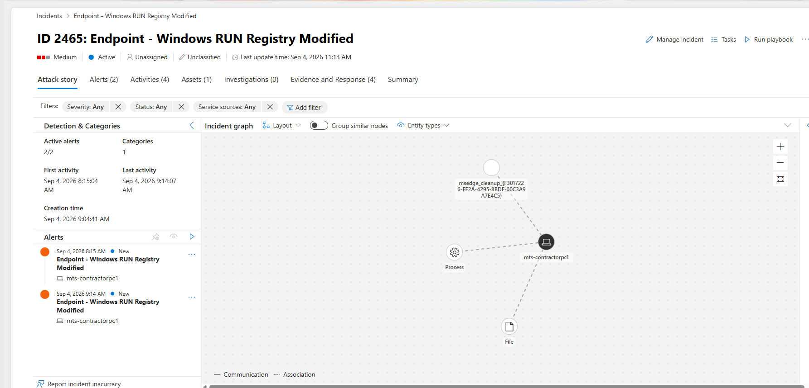
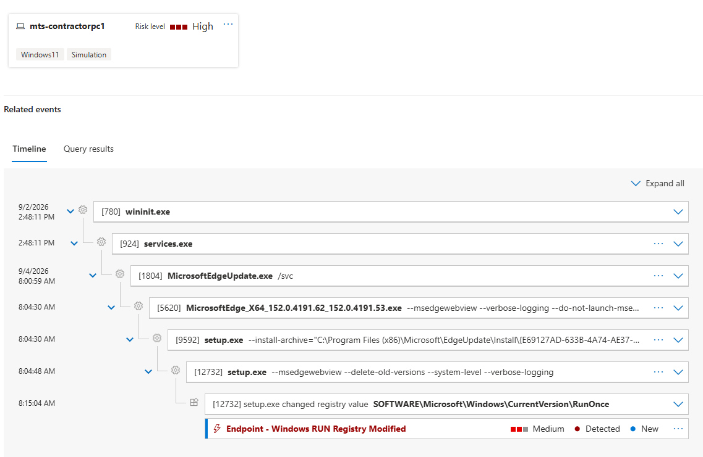
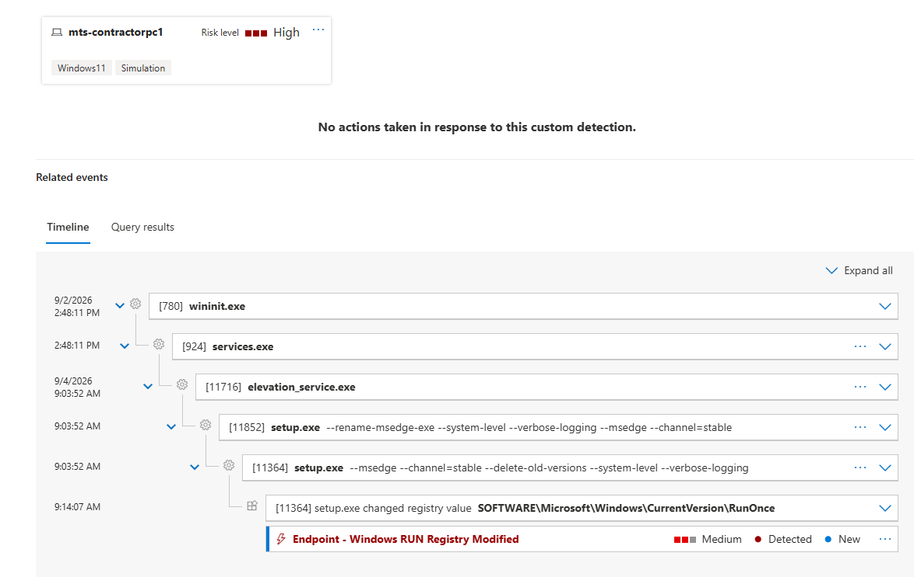
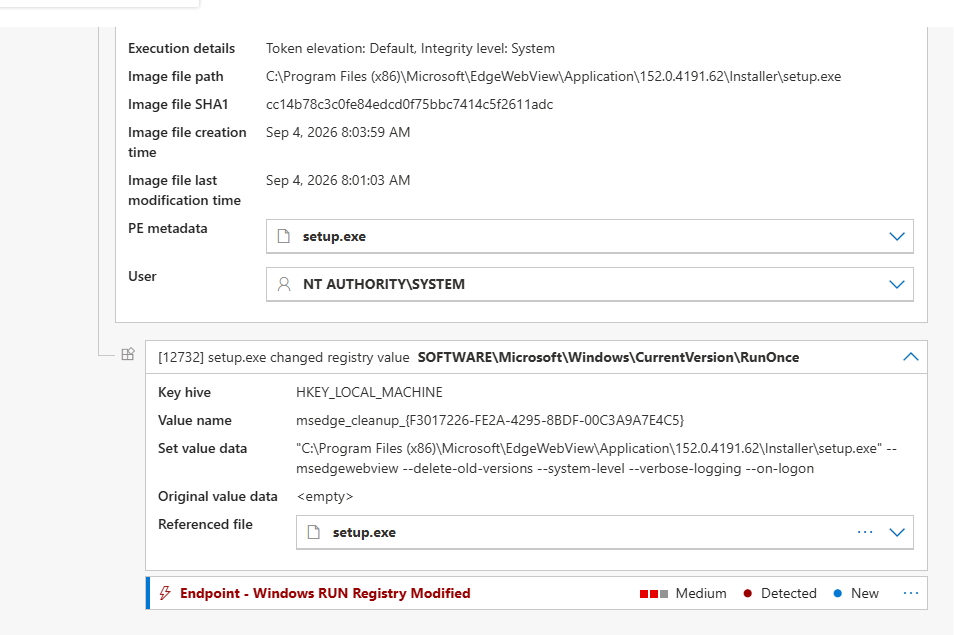
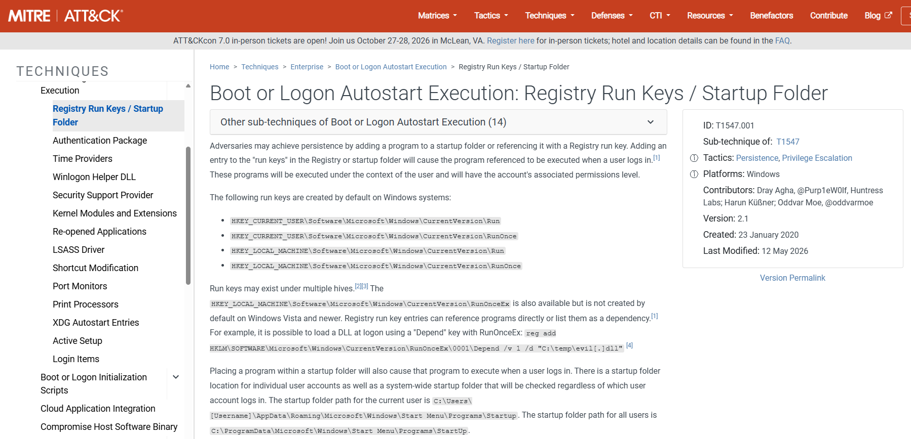
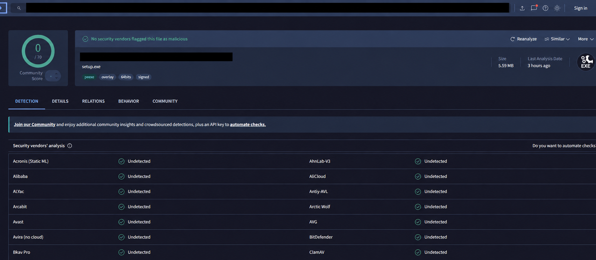
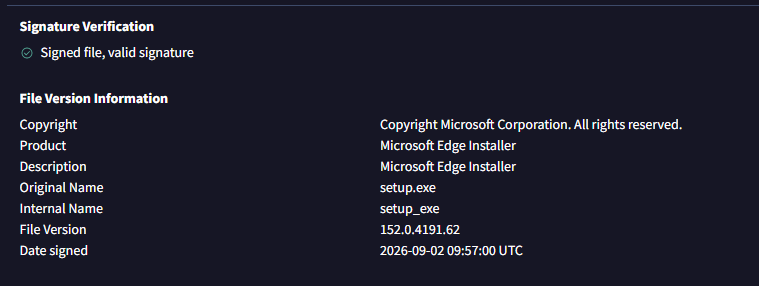
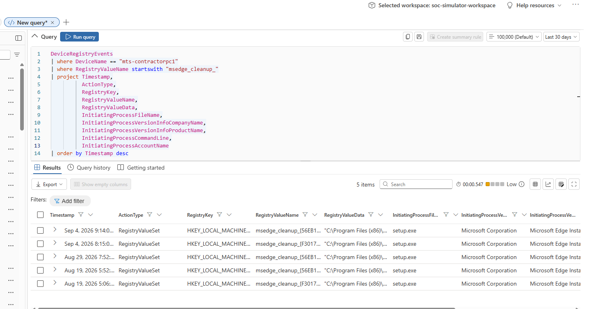
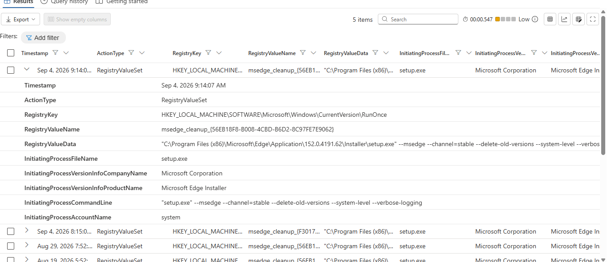

# Microsoft Defender XDR - Windows Run Registry Investigation

## Findings

* **Alert:** Endpoint - Windows RUN Registry Modified
* **Severity:** Medium
* **Date:** September 4, 2026
* **Endpoint:** `mts-contractorpc1`
* **Operating System:** Windows 11
* **Initiating Process:** `setup.exe`
* **Registry Key:** `HKEY_LOCAL_MACHINE\SOFTWARE\Microsoft\Windows\CurrentVersion\RunOnce`
* **Registry Value:** `msedge_cleanup_{GUID}`
* **Execution Account:** `NT AUTHORITY\SYSTEM`
* **MITRE ATT&CK:** T1547.001 - Registry Run Keys / Startup Folder
* **VirusTotal Result:** 0/70 security vendors detected the file as malicious
* **Final Verdict:** Benign
* **Impact:** No compromise identified
* **Remediation:** None required

## Investigation Summary

Microsoft Defender XDR generated two medium-severity alerts after `setup.exe` modified values under the Windows `RunOnce` registry key.

Because attackers can use Run and RunOnce keys to establish persistence, I reviewed the process trees, registry data, command-line arguments, execution account, file reputation, digital signature, and historical endpoint activity.

The process trees showed that Microsoft Edge update components launched `setup.exe`. The registry value referenced the Microsoft Edge installer and included arguments for deleting old versions during the next user logon.

VirusTotal returned 0/70 security-vendor detections, and the file had a valid Microsoft digital signature. Advanced Hunting also identified five similar events across three separate dates.

Based on the combined evidence, the registry modifications were legitimate Microsoft Edge update and cleanup activity.

## Who, What, When, Where, Why, and How

* **Who:** The activity was performed by `setup.exe` under the `NT AUTHORITY\SYSTEM` account.

* **What:** Microsoft Edge installation components created or modified `RunOnce` registry values named `msedge_cleanup_{GUID}`.

* **When:** The two alerts occurred on September 4, 2026, at approximately 8:15 AM and 9:14 AM.

* **Where:** The activity occurred on the Windows 11 endpoint `mts-contractorpc1` under `HKEY_LOCAL_MACHINE\SOFTWARE\Microsoft\Windows\CurrentVersion\RunOnce`.

* **Why:** Microsoft Edge used the RunOnce key to complete update cleanup and remove older application versions during the next logon.

* **How:** Microsoft Edge update services launched the Edge installer and `setup.exe`, which created the RunOnce cleanup value with stable-channel, system-level, delete-old-versions, and on-logon arguments.

## Process Analysis

The first alert followed this process chain:

`wininit.exe` → `services.exe` → `MicrosoftEdgeUpdate.exe` → Microsoft Edge installer → `setup.exe` → RunOnce registry modification

The second alert involved:

`wininit.exe` → `services.exe` → `elevation_service.exe` → `setup.exe` → RunOnce registry modification

No suspicious PowerShell, command shell, script interpreter, temporary-directory payload, or unrelated user-launched process appeared in either process chain.

## Advanced Hunting Query

```kusto
DeviceRegistryEvents
| where DeviceName == "mts-contractorpc1"
| where RegistryValueName startswith "msedge_cleanup_"
| project Timestamp,
          ActionType,
          RegistryKey,
          RegistryValueName,
          RegistryValueData,
          InitiatingProcessFileName,
          InitiatingProcessVersionInfoCompanyName,
          InitiatingProcessVersionInfoProductName,
          InitiatingProcessCommandLine,
          InitiatingProcessAccountName
| order by Timestamp desc
```

The query returned five matching registry events across August 19, August 29, and September 4. Each event was initiated by `setup.exe` and identified as Microsoft Edge Installer activity.

This historical recurrence established a normal maintenance baseline and reduced the likelihood of malicious persistence.

## Recommendations

1. No containment or remediation is required because the activity was confirmed as legitimate Microsoft Edge maintenance.
2. Document the recurring behavior as an expected endpoint baseline.
3. Continue monitoring for Run or RunOnce modifications involving unsigned files, unexpected paths, suspicious command lines, or unusual parent processes.
4. Do not suppress the detection solely because this event was benign. Future alerts should still be validated using process, registry, reputation, signature, and historical evidence.

## Supporting Evidence

### 1. Incident Overview

Two medium-severity alerts were correlated on the same Windows 11 endpoint.



### 2. First Alert Process Tree

The first alert showed Microsoft Edge update components launching `setup.exe`.



### 3. Second Alert Process Tree

The second alert showed `elevation_service.exe` and `setup.exe` performing Edge cleanup activity.



### 4. RunOnce Registry Details

The registry value referenced the Microsoft Edge installer and included cleanup arguments.



### 5. MITRE ATT&CK Mapping

The behavior mapped to T1547.001 - Registry Run Keys / Startup Folder.



### 6. VirusTotal Reputation

VirusTotal returned 0/70 security-vendor detections.



### 7. Digital Signature Verification

The file had a valid Microsoft signature and was identified as Microsoft Edge Installer.



### 8. Advanced Hunting Baseline

Advanced Hunting returned five similar registry events across three dates.



### 9. Expanded Advanced Hunting Event

The expanded result confirmed the RunOnce path, Edge installer metadata, cleanup command line, and SYSTEM execution context.



## Final Verdict

The alert was resolved as **Benign**. Microsoft Defender XDR correctly detected a Windows RunOnce registry modification, but the underlying activity was legitimate Microsoft Edge update and cleanup behavior.

No malicious persistence, endpoint compromise, or actionable indicator of compromise was identified.

> This investigation was completed in an authorized MYDFIR SOC simulation environment for educational and portfolio purposes.
